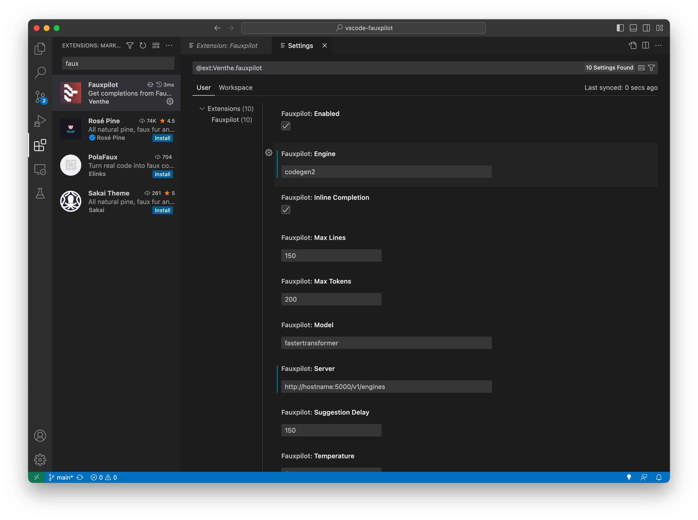

# Lightweight FauxPilot

This project is inspired by
[FauxPilot](https://github.com/fauxpilot/fauxpilot), but aimed at making it
very lightweight so we can deploy it locally without Docker, and easier to
debug the model operation.

The original FauxPilot project uses only the
[CodeGen](https://huggingface.co/Salesforce/codegen-2B-mono) model. Adding new
model to it requires non-trivial work. It also depends on nVidia Triton server
and docker to run. It would be handy if you want to deploy it, but not so
convenient if you **just want it run**.

The modification here get rid of all these dependencies: The code has been
trimmed down to only a FastAPI server running on Uvicorn that speaks the GitHub
copilot REST API. All code generation function are delegated to another
function, which basically takes the prompt as a string, and returns the
completion as another string.

Because of this simplification, several models are supported, and new models
can be added easily according to the Hugging Face model card. In this
repository, the models supported are:

- CodeGen ([codegen-2B-mono](https://huggingface.co/Salesforce/codegen-2B-mono))
- CodeGen2 ([codegen2-1B](https://huggingface.co/Salesforce/codegen2-1B))
- CodeT5 ([codet5-base](https://huggingface.co/Salesforce/codet5-base))
- CodeT5+ ([codet5p-770m](https://huggingface.co/Salesforce/codet5p-770m))

The code that invokes these models are at [`fauxpilot_lite/model.py`](https://github.com/righthandabacus/fauxpilot_lite/blob/master/fauxpilot_lite/model.py). You should
see there's high resemblance to the sample code in the model card.

## How to use

On server side, simply run the uvicorn server. At the root directory of this repo, run

    python -m fauxpilot_lite.app

or equivalently,

    uvicorn "fauxpilot_lite.app:app" --host 0.0.0.0 --port 5000

On the client side, you can test the operation using curl:

    curl -d @request.json -H "Content-Type: application/json" http://hostname:5000/v1/engines/codegen2/completions

where the POST body is in the JSON file `request.json`, as follows:

```json
{
  "model": "doesntmatter",
  "prompt": "import os\nimport math\n\ndef black_sch",
  "suffix": null,
  "max_tokens": 200,
  "temperature": 0.1,
  "top_p": 1.0,
  "n": 1,
  "stream": null,
  "logprobs": null,
  "echo": null,
  "stop": ["\n"],
  "presence_penalty": 0,
  "frequency_penalty": 1,
  "best_of": 1,
  "logit_bias": null,
  "user": null
}
```

If success, you should see a response like the follows on screen:

```
{
    "id": "cmpl-dfEO1KnccON8HLG57NpkqUYOtTZbD",
    "model": "codegen2",
    "object": "text_completion",
    "created": 1689457439,
    "choices": [
        {
            "text": "oles_impl(options, data):\n    \"\"\"\n    Black-Scholes formula for the option price.\n    \"\"\"\n    #",
            "index": 0,
            "finish_reason": "stop",
            "logprobs": null
        }
    ],
    "usage": {
        "completion_tokens": 29,
        "prompt_tokens": 11,
        "total_tokens": 40
    }
}
```

To actually use it, you need a plugin in your IDE. For VSCode, you can use the
[FauxPilot](https://marketplace.visualstudio.com/items?itemName=Venthe.fauxpilot)
plugin. You just need to change the server and engine, as in the screenshot
below:


